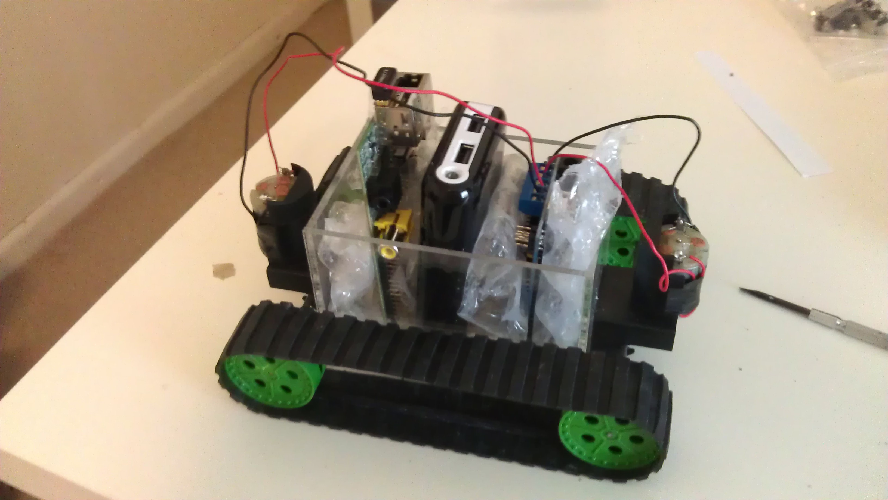

Reconnaissance Rover
====================

The code and documentation for a mobile reconnaissance rover. The rover was built in 2013 equipped with a Raspberry PI and an Arduino which worked in tandem to both drive the motors and communicate with the remote server.

